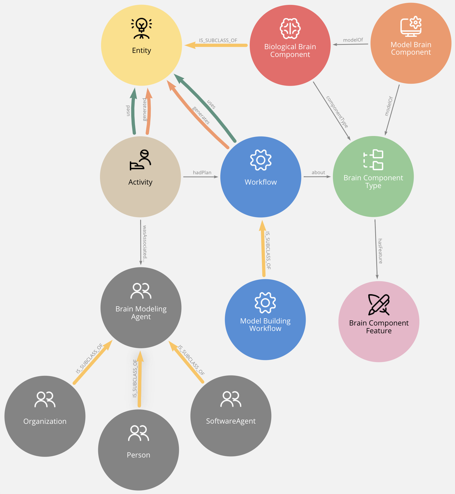

Overview
========

High level classes and properties
---------------------------------
Main high level classes and properties defined in BMO.

+-----------------------------+-------------------------------------------------------------------------------------------------------------------------------------------------------------------------------------------------------+
| Class                       | Definition                                                                                                                                                                                            |
+=============================+=======================================================================================================================================================================================================+
| `Entity`                    | A Brain Modeling Entity is any entity (biological or modeled) that can be used or generated in the process of digitally reconstructing brain tissue                                                   |
+-----------------------------+-------------------------------------------------------------------------------------------------------------------------------------------------------------------------------------------------------+
| `BiologicalBrainComponent`  | A Biological Brain Component is a biological entity part of a brain.                                                                                                                                  |
+-----------------------------+-------------------------------------------------------------------------------------------------------------------------------------------------------------------------------------------------------+
| `ModelBrainComponent`       | A Model Brain Component is a digital replica of a Biological Brain Component.                                                                                                                         |
+-----------------------------+-------------------------------------------------------------------------------------------------------------------------------------------------------------------------------------------------------+
| `BrainComponentType`        | Classification of Brain Components whether biological or model.                                                                                                                                       |
+-----------------------------+-------------------------------------------------------------------------------------------------------------------------------------------------------------------------------------------------------+
| `BrainComponentFeature`     | A measurable property or feature of a biological or model brain component.                                                                                                                            |
+-----------------------------+-------------------------------------------------------------------------------------------------------------------------------------------------------------------------------------------------------+
| `Activity`                  | An activity is something that occurs over a period of time and acts upon or with entities; it may include consuming, processing, transforming, modifying, relocating, using, or generating entities.  |
+-----------------------------+-------------------------------------------------------------------------------------------------------------------------------------------------------------------------------------------------------+
| `Workflow`                  | A workflow represents a set of actions or steps intended by one or more agents to achieve some goals. A workflow is a specification or a plan and is instantiated by activities.                      |
+-----------------------------+-------------------------------------------------------------------------------------------------------------------------------------------------------------------------------------------------------+
| `BrainModelingAgent`        | A Brain Modeling Agent is an organization, a person or a software agent that is engaged in the process of digitally reconstructing brain tissue.                                                      |
+-----------------------------+-------------------------------------------------------------------------------------------------------------------------------------------------------------------------------------------------------+
